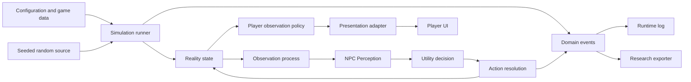

# Architecture

**Status:** Draft
**Technology:** 未決定。ここでは技術名ではなく境界を定める。

## Baseline constraints

- 表示層なしでシミュレーションを実行・テストできる。
- 客観状態、主観認識、意思決定を別の責務として保つ。
- モジュールを設定・interface・eventで接続し、交換可能にする。
- 同じ初期状態、設定、seed、コード版から実行を再現できる。
- 個別システムは理解可能にしつつ、相互作用による創発を許す。

## Conceptual flow

以下は上記制約を具体化する提案であり、確定したモジュール構成ではない。

## Dependency rules

1. **Simulation core does not depend on presentation.** UIやゲームエンジンはadapterとして外側から接続する。
2. **Decision does not depend on Reality.** 意思決定へ渡す型はPerception専用とし、客観状態を参照できなくする。
3. **Unrelated domain modules do not depend on each other directly.** 関連モジュールの連携も、明示的なcommand、event、query interfaceで行う。
4. **Configuration enters from the boundary.** 調整値をglobal定数や隠れたsingletonへ置かない。
5. **Randomness is a dependency.** 各モジュールが独自に非seed乱数を生成しない。
6. **Logging observes behavior.** ロガーがドメイン判断を変えない。
7. **The runner coordinates, but does not own domain rules.** 処理順とlifecycleだけを担当し、万能な `GameManager` にしない。

## State layers

### Reality

世界の完全な客観状態。保存・replay・デバッグには使えるが、NPCの意思決定へ直接公開しない。

### Perception

NPCごとの不完全で主観的な状態。将来、観測、記憶、伝聞、誤差、遅延を扱う可能性があるが、その具体モデルは未決定。

### Presentation view

プレイヤーへ提示してよい情報。Realityのデバッグ表示とは別のprojectionとして設計する。

## Proposed replay envelope

再現可能な実験には、少なくとも次をひとまとまりで保存する。

- initial stateまたはそれを生成するpreset
- 完全なconfig
- random seed
- 実行したtick数または終了条件
- コードのcommit hash
- 必要なら外部入力列

## Technical decisions still open

- 実装言語とゲームエンジン。
- 同期更新、イベント駆動、または混合方式。
- 永続化形式とschema versioning。
- event busをプロセス内interfaceにするか、単純な戻り値にするか。
- 大規模個体数に対する性能目標。
