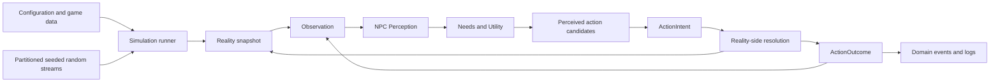
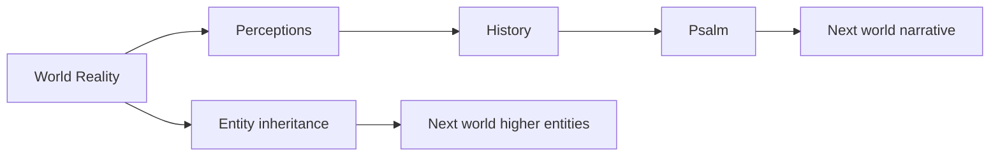

# Architecture

**Status:** Baseline constraints / Draft mechanics

**Technology:** v0はC# / .NET。UI frameworkは未決定。

## Baseline constraints

- 表示層なしでシミュレーションを実行・テストできる。
- 客観状態、主観認識、意思決定、行動解決を別の責務として保つ。
- モジュールを設定、interface、明示的なcommand・event・queryで接続する。
- 同じ初期状態、設定、seed、コード版、外部入力から実行を再現できる。
- 個別システムは理解可能にしつつ、相互作用による創発を許す。
- LLMとPresentationをSimulation Coreの外側に置く。
- `Simulation.Core`、`Simulation.App`、`Simulation.Core.Tests` の依存方向を `App/Tests -> Core` に限定する。
- GUIのrender loopとSimulation tickを分離し、CoreだけをRealityの権威とする。

## Decision and action flow



## World-to-world flow



## Dependency rules

1. **Simulation Core does not depend on Presentation.** UIやゲームエンジンはadapterとして外側から接続する。
2. **Decision does not depend on Reality.** Utility評価器へ渡す型はPerception専用にする。
3. **Resolution is authoritative.** ActionIntentの成立可否とReality更新はドメイン側が担当する。
4. **Unrelated domain modules do not depend on each other directly.** 連携は明示的なcommand、event、query interfaceで行う。
5. **Configuration enters from the boundary.** 調整値をglobal定数や隠れたsingletonへ置かない。
6. **Randomness and time are dependencies.** 各モジュールが独自に非seed乱数や壁時計を取得しない。
7. **Logging observes behavior.** ロガーやNarrative Generatorがドメイン結果を変えない。
8. **The runner coordinates, but does not own domain rules.** 処理順とlifecycleだけを担当する。
9. **LLM has no simulation authority.** ログ・主観・ピンから人間可読出力を作る交換可能なadapterに限定する。

## State layers

### Reality

世界の完全な客観状態。保存、replay、デバッグには使えるが、NPCの意思決定へ直接公開しない。

### Perception

NPCごとの不完全で主観的な状態。観測、記憶、噂、関係、文化的解釈を保持し得る。

### History and Psalm

Historyは住人の認識を含む世界の語られ方、Psalmは次世界へ渡す物語表現である。どちらもReality Storeの代わりにしない。

### Presentation view

プレイヤーへ提示してよい現在中心の情報。Realityのデバッグ表示とは別のprojectionにする。

## Replay envelope

再現可能な実験には、少なくとも次をひとまとまりで保存する。

- initial stateまたは生成preset
- 完全なconfig
- random seed
- 実行したtick数または終了条件
- コードのcommit hash
- プレイヤー介入を含む外部入力列

v0のPRNGは単一共有列にせず、run seedと `subsystem / tick / entity / purpose` から用途別streamを派生する。描画、ログ整形、診断がSimulation用streamを消費してはならない。

## v0 project boundary

```text
Simulation.App --------> Simulation.Core
Simulation.Core.Tests -> Simulation.Core
Simulation.Core -------> no Presentation dependency
```

AppはSnapshotまたはread-only projectionと構造化Event streamを受け取る。UI入力はCoreの明示的commandへ変換し、Core stateを直接変更しない。

## Technical decisions still open

- Desktop UI framework。
- v0で定めた同期処理を実装する具体的なstate slice、commit API、event delivery方式。
- 永続化形式とschema versioning。
- event busを使用するか、明示的な呼び出しと戻り値を使うか。
- 大規模個体数に対する性能目標。
